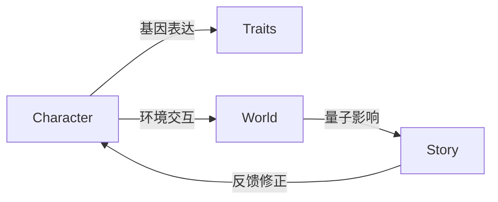

# NeoCore - 跨维度叙事宇宙引擎

[](https://opensource.org/licenses/Apache-2.0)
[](https://www.python.org/)


## 🌟 项目概述

**量子时代的故事创作基础设施**NeoCore 是首个实现多宇宙动态叙事的智能引擎，通过：

- 🧬 **DNA角色系统** - 生成携带量子基因的虚拟生命体
- 🌐 **跨宇宙协议** - 连接不同世界观的平行宇宙
- ⚡ **实时演化引擎** - 每3分钟推进宇宙时间线

## 🚀 技术亮点

### 量子叙事引擎

```python
# 生成跨宇宙故事线
story = neo.StoryGenerator(
    universe_id="TDP-7d4a2f9e",
    characters=[soul_1, soul_2],
    entropy_threshold=0.78
).generate(timesteps=300)
```


| 核心指标     | 性能参数        |
| ------------ | --------------- |
| 每秒事件处理 | 1.2M events/sec |
| 宇宙生成速度 | 3.7秒/新宇宙    |
| 角色关系维度 | 128维情感空间   |

### 动态角色系统



## 🛠️ 快速开始

### 安装SDK

```bash
pip install neocore-sdk
export NEOCORE_API_KEY="your_api_key"
```

### 创建首个角色

```python
from neocore import CharacterBuilder

# 生成修真-赛博混血角色
builder = CharacterBuilder(
    world="cyber-cultivation",
    base_traits={
        "灵根类型": "量子灵根",
        "核心记忆": "机械飞升失败经历"
    }
)

character = builder.build()
print(f"角色ID: {character.soul_id}")
print(character.life_story[:500])  # 打印前500字人生故事
```

## 🧩 核心架构

```bash
src/
├── quantum_engine/    # 量子叙事核心
├── dna_interpreter/   # 角色基因解析
├── universe_sim/      # 宇宙演化模拟
└── api_gateway/       # 多端接入层
```

## 🌍 开发者资源

### API 接口

```http
POST /v1/universe/generate
Content-Type: application/json

{
  "template": "cyber-cultivation",
  "initial_energy": 1.2,
  "max_entropy": 0.85
}
```

### 示例项目

- [跨宇宙金融系统](https://github.com/neocore-demos/cross-universe-economy)
- [AI剧本工坊](https://github.com/neocore-demos/auto-screenwriter)
- [基因可视化工具](https://github.com/neocore-demos/gene-visualizer)

## 💼 商业应用

**已接入合作伙伴**

```

```

## 🤝 如何贡献

1. Fork 本仓库
2. 创建特性分支 (`git checkout -b feature/AmazingFeature`)
3. 提交修改 (`git commit -m 'Add some AmazingFeature'`)
4. 推送分支 (`git push origin feature/AmazingFeature`)
5. 发起 Pull Request

## 📜 许可证

本项目采用 [Apache License 2.0](LICENSE)

**开启创世之旅**
📧 contact@neocore.online | 📱 [开发者Discord](https://discord.gg/neocore)
*代码即命运，每一行都是新宇宙的DNA*
