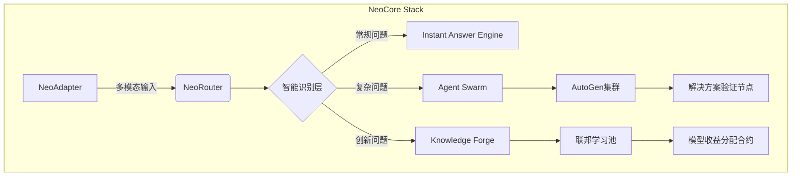

# NeoCore - 下一代AI智能体协作操作系统

 


## 🚀 愿景宣言
**"构建开放智能体的创世纪"**  
我们正在打造首个面向AGI时代的开发者协作网络——  
一个由智能体自治驱动、开发者赋能的去中心化人工智能操作系统。  
在这里，每个算法都是可组合的智能基元，每个问题都在训练群体智能，每个贡献者都是新物种的创世主。

---

## 🌟 核心特性

### 自进化知识网络
- **Dynamic RAG 2.0**：实时更新的多模态知识图谱  
- **问题引力场**：未解问题自动吸引相关开发者  
- **Proof-of-Learning**：贡献训练数据获得加密凭证

### 智能体协作层
- **AgentOS**：基于AutoGen的分布式调度引擎  
- **技能NFT化**：封装AI能力为可交易模块  
- **联邦沙盒**：隔离环境下的多智能体对抗训练

### 开发者经济系统
- **Bounty DAO**：智能合约驱动的悬赏揭榜机制  
- **Skill Tree**：10级开发者能力认证体系  
- **Gas Fee Recycle**：50%网络费用反哺核心贡献者

---

## 🛠️ 架构蓝图



---

## 🗺️ 开发路线图

### 2025 Q2 - 创世启动
- [x] 核心路由引擎v0.1 (基于Dify Workflow)  
- [ ] 开发者DID系统原型  
- [ ] 智能体技能标准草案发布

### 2025 Q3 - 蜂群觉醒
- [ ] 多智能体协作层上线（集成AutoGen）  
- [ ] 首个联邦学习框架测试网  
- [ ] NFT技能市场MVP发布

### 2025 Q4 - 奇点临近
- [ ] 去中心化自治组织(DAO)上线  
- [ ] 跨链智能合约支持  
- [ ] NeoCore主网1.0发布

---

## 🤝 参与构建新纪元

### 贡献者指南
1. **提交问题**  
   ```bash
   /neocore submit_issue [类别] [紧急度]
   ```
2. **认领任务**  
   查看[Bounty Board](https://neocore.ai/bounties)并质押代币接单

3. **开发规范**  
   - 遵循[NeoCore接口标准](docs/standards.md)  
   - 通过[智能体兼容性测试](test/agent_compat.py)

### 社区治理
- **代币经济**：NCR代币用于治理与资源分配  
- **决策机制**：双轨制投票（开发者+智能体）  
- **透明度**：所有决策记录于[Governance Ledger](gov.neocore.ai)

---

## 📜 开源协议
本项目采用 **AGPL-3.0** 协议开放源代码，附加以下特别条款：  
- 商业应用需通过[NCR代币](economy.neocore.ai)购买许可  
- 衍生项目必须继承贡献者奖励机制

---

> _"The best way to predict the future is to create it."_  
> 加入Discord社区：[discord.gg/neocore](https://discord.gg/neocore)  
> 白皮书草案：[whitepaper.neocore.ai](https://whitepaper.neocore.ai)
