# NeoCore - 跨维度叙事宇宙引擎

[](https://opensource.org/licenses/Apache-2.0)
[](https://www.python.org/)


## 🌟 项目概述

**量子时代的故事创作基础设施**NeoCore 是首个实现多宇宙动态叙事的智能引擎，通过：

- 🧬 **DNA角色系统** - 生成携带量子基因的虚拟生命体
- 🌐 **跨宇宙协议** - 连接不同世界观的平行宇宙
- ⚡ **实时演化引擎** - 每3分钟推进宇宙时间线

## 🚀 技术亮点

### 量子叙事引擎

```python
# 生成跨宇宙故事线
story = neo.StoryGenerator(
    universe_id="TDP-7d4a2f9e",
    characters=[soul_1, soul_2],
    entropy_threshold=0.78
).generate(timesteps=300)
```


| 核心指标     | 性能参数        |
| ------------ | --------------- |
| 每秒事件处理 | 1.2M events/sec |
| 宇宙生成速度 | 3.7秒/新宇宙    |
| 角色关系维度 | 128维情感空间   |

### 动态角色系统

```mermaid
graph LR
    Character -->|基因表达| Traits
    Character -->|环境交互| World
    World -->|量子影响| Story
    Story -->|反馈修正| Character
```



## 🛠️ 快速开始

### 安装SDK

```bash
pip install neocore-sdk
export NEOCORE_API_KEY="your_api_key"
```

### 创建首个角色

```python
from neocore import CharacterBuilder

# 生成修真-赛博混血角色
builder = CharacterBuilder(
    world="cyber-cultivation",
    base_traits={
        "灵根类型": "量子灵根",
        "核心记忆": "机械飞升失败经历"
    }
)

character = builder.build()
print(f"角色ID: {character.soul_id}")
print(character.life_story[:500])  # 打印前500字人生故事
```

## 🧩 核心架构

```bash
src/
├── quantum_engine/    # 量子叙事核心
├── dna_interpreter/   # 角色基因解析
├── universe_sim/      # 宇宙演化模拟
└── api_gateway/       # 多端接入层
```

## 🌍 开发者资源

### API 接口

```http
POST /v1/universe/generate
Content-Type: application/json

{
  "template": "cyber-cultivation",
  "initial_energy": 1.2,
  "max_entropy": 0.85
}
```

### 示例项目

- [跨宇宙金融系统](https://github.com/neocore-demos/cross-universe-economy)
- [AI剧本工坊](https://github.com/neocore-demos/auto-screenwriter)
- [基因可视化工具](https://github.com/neocore-demos/gene-visualizer)

## 💼 商业应用

**已接入合作伙伴**

```

```

## 🤝 如何贡献

1. Fork 本仓库
2. 创建特性分支 (`git checkout -b feature/AmazingFeature`)
3. 提交修改 (`git commit -m 'Add some AmazingFeature'`)
4. 推送分支 (`git push origin feature/AmazingFeature`)
5. 发起 Pull Request

## 📜 许可证

本项目采用 [Apache License 2.0](LICENSE)

**开启创世之旅**
📧 contact@neocore.online | 📱 [开发者Discord](https://discord.gg/neocore)
*代码即命运，每一行都是新宇宙的DNA*

# 三纪元角色创建系统

这是一个基于Web的角色创建系统，允许用户创建和管理虚拟角色。

## 功能特点

- 创建新世界或选择现有世界
- 创建具有详细属性的角色
- 支持三个纪元：修真、现代、未来
- 自动生成角色详细描述
- 响应式Web界面

## 安装步骤

1. 确保已安装Python 3.8或更高版本
2. 克隆此仓库
3. 安装依赖：
   ```bash
   pip install -r requirements.txt
   ```
4. 设置环境变量：
   ```bash
   export DEEPSEEK_API_KEY="your-api-key-here"
   ```

## 运行应用

1. 启动Flask应用：
   ```bash
   python app.py
   ```
2. 在浏览器中访问：
   ```
   http://localhost:5000
   ```

## 使用说明

1. 在主页面上，您可以选择现有世界或创建新世界
2. 填写角色信息：
   - 角色名称
   - 性别
   - 所属纪元
   - 出生日期和时间
3. 点击"创建角色"按钮
4. 系统将生成角色并显示详细信息

## 目录结构

```
.
├── app.py                 # Flask应用主文件
├── requirements.txt       # 项目依赖
├── templates/            # HTML模板
│   └── create_character.html
└── WorldBuilder/         # 角色创建核心逻辑
    ├── create_random_character.py
    └── tdp_system.py
```

## 注意事项

- 确保已正确设置DEEPSEEK_API_KEY环境变量
- 首次运行时会自动创建必要的目录结构
- 所有角色数据将保存在my_universes目录中
