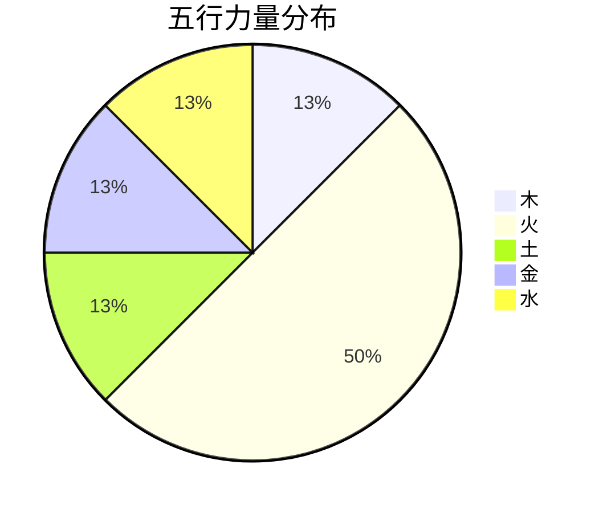
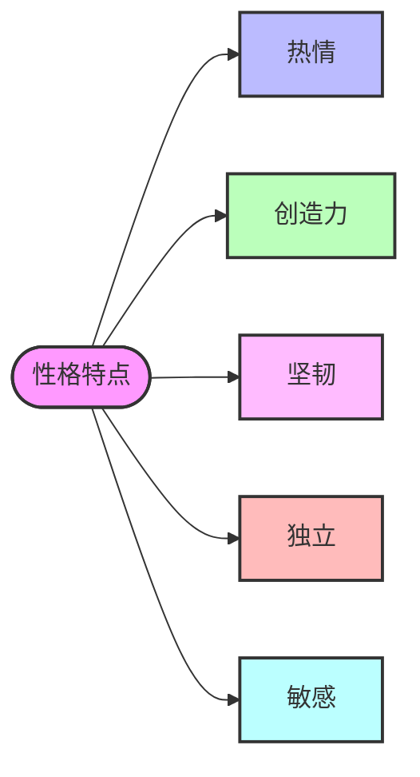
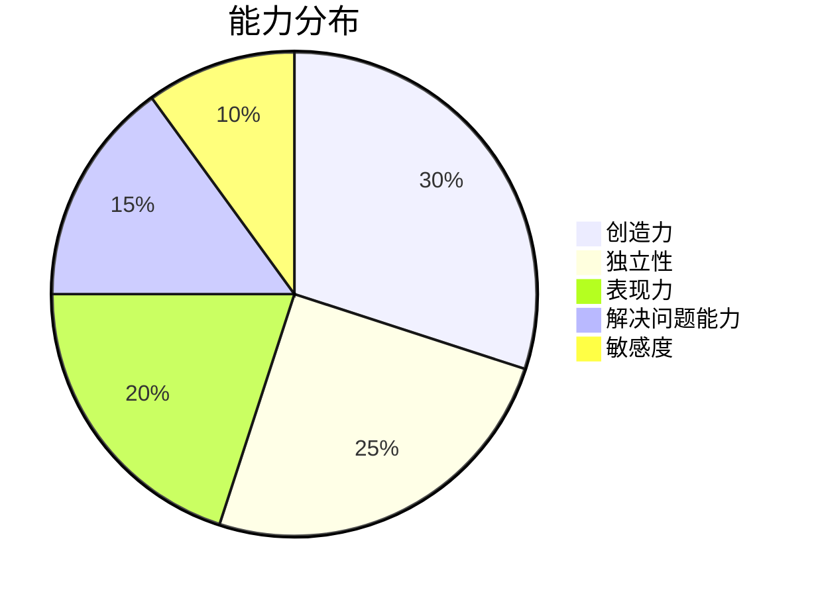
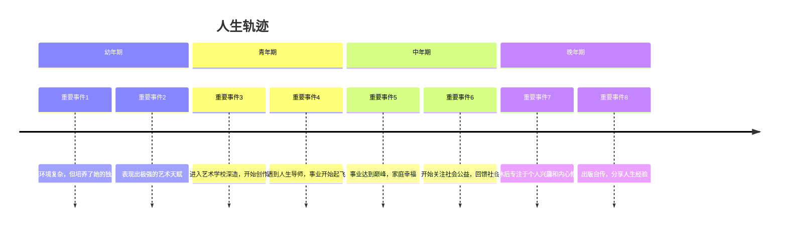

# 费琴华 的角色分析

## 基本信息
- 性别：女
- 出生时间：1987-06-30T22:00:00
- 纪元：modern

## 八字信息
- 八字：丁卯丙午庚戌丁亥

### 八字结构
<table>
  <tr>
    <th>年柱</th>
    <th>月柱</th>
    <th>日柱</th>
    <th>时柱</th>
  </tr>
  <tr>
    <td style='background-color:#f9f9ff;text-align:center;font-weight:bold;'>丁卯</td>
    <td style='background-color:#e6e6ff;text-align:center;font-weight:bold;'>丙午</td>
    <td style='background-color:#e6ffe6;text-align:center;font-weight:bold;'>庚戌</td>
    <td style='background-color:#ffe6ff;text-align:center;font-weight:bold;'>丁亥</td>
  </tr>
</table>

### 五行分布

五行分布详情（点击展开）

<table>
  <tr>
    <th>金</th>
    <th>木</th>
    <th>水</th>
    <th>火</th>
    <th>土</th>
  </tr>
  <tr>
    <td style='background-color:#FFD700;text-align:center;'>1 (25%)</td>
    <td style='background-color:#90EE90;text-align:center;'>1 (25%)</td>
    <td style='background-color:#87CEFA;text-align:center;'>1 (25%)</td>
    <td style='background-color:#FF6347;text-align:center;'>4 (100%)</td>
    <td style='background-color:#D2B48C;text-align:center;'>1 (25%)</td>
  </tr>
</table>

## 世界背景
未知世界背景

### 角色描述：费琴华

#### 基本信息
- **姓名**：费琴华
- **性别**：女性
- **出生时间**：1987年6月30日22:00
- **纪元**：未知
- **八字**：丁卯 丙午 庚戌 丁亥
- **五行统计**：木: 1, 火: 4, 土: 1, 金: 1, 水: 1
- **日主**：金
- **格局**：偏财格

#### 性格特点
费琴华的性格特点可以从她的八字中窥见一斑。她的五行中火元素极为旺盛，这赋予了她热情、活力和创造力。然而，日主为金，金在火中显得脆弱，因此她内心可能隐藏着一种坚韧和不屈的精神。

性格特点详情（点击展开）

<table>
  <tr>
    <th colspan="5">性格特点</th>
  </tr>
  <tr>
    <td style='background-color:#f9f9ff;text-align:center;'>热情</td>
    <td style='background-color:#e6e6ff;text-align:center;'>创造力</td>
    <td style='background-color:#e6ffe6;text-align:center;'>坚韧</td>
    <td style='background-color:#ffe6ff;text-align:center;'>独立</td>
    <td style='background-color:#fff9e6;text-align:center;'>敏感</td>
  </tr>
</table>

#### 天赋能力
费琴华的天赋能力主要体现在她的创造力和独立性上。她的五行中火元素旺盛，这使她具有极强的创造力和表现力。同时，日主为金，金在火中显得坚韧，这赋予了她独立解决问题的能力。

能力分布详情（点击展开）

<table>
  <tr>
    <th>创造力</th>
    <th>独立性</th>
    <th>表现力</th>
    <th>解决问题能力</th>
    <th>敏感度</th>
  </tr>
  <tr>
    <td style='background-color:#FFD700;text-align:center;'>30%</td>
    <td style='background-color:#90EE90;text-align:center;'>25%</td>
    <td style='background-color:#87CEFA;text-align:center;'>20%</td>
    <td style='background-color:#FF6347;text-align:center;'>15%</td>
    <td style='background-color:#D2B48C;text-align:center;'>10%</td>
  </tr>
</table>

#### 人生轨迹
费琴华的人生轨迹充满了挑战和机遇。她的幼年期和青年期充满了学习和探索，中年期则是她事业和家庭的双丰收期，晚年期则更多地关注内心的平静和满足。

人生轨迹详情（点击展开）

<table>
  <tr>
    <th colspan="2">幼年期</th>
  </tr>
  <tr>
    <td style='background-color:#f9f9ff;'>重要事件1</td>
    <td>家庭环境复杂，但培养了她的独立性</td>
  </tr>
  <tr>
    <td style='background-color:#f9f9ff;'>重要事件2</td>
    <td>表现出极强的艺术天赋</td>
  </tr>
  <tr>
    <th colspan="2">青年期</th>
  </tr>
  <tr>
    <td style='background-color:#e6e6ff;'>重要事件3</td>
    <td>进入艺术学校深造，开始创作</td>
  </tr>
  <tr>
    <td style='background-color:#e6e6ff;'>重要事件4</td>
    <td>遇到人生导师，事业开始起飞</td>
  </tr>
  <tr>
    <th colspan="2">中年期</th>
  </tr>
  <tr>
    <td style='background-color:#e6ffe6;'>重要事件5</td>
    <td>事业达到巅峰，家庭幸福</td>
  </tr>
  <tr>
    <td style='background-color:#e6ffe6;'>重要事件6</td>
    <td>开始关注社会公益，回馈社会</td>
  </tr>
  <tr>
    <th colspan="2">晚年期</th>
  </tr>
  <tr>
    <td style='background-color:#ffe6ff;'>重要事件7</td>
    <td>退休后专注于个人兴趣和内心修养</td>
  </tr>
  <tr>
    <td style='background-color:#ffe6ff;'>重要事件8</td>
    <td>出版自传，分享人生经验</td>
  </tr>
</table>

费琴华的一生充满了色彩和变化，她的热情和创造力使她在艺术领域取得了卓越的成就，而她的坚韧和独立性则帮助她克服了生活中的种种挑战。她的晚年则更多地关注内心的平静和满足，成为了一个充满智慧和经验的导师。