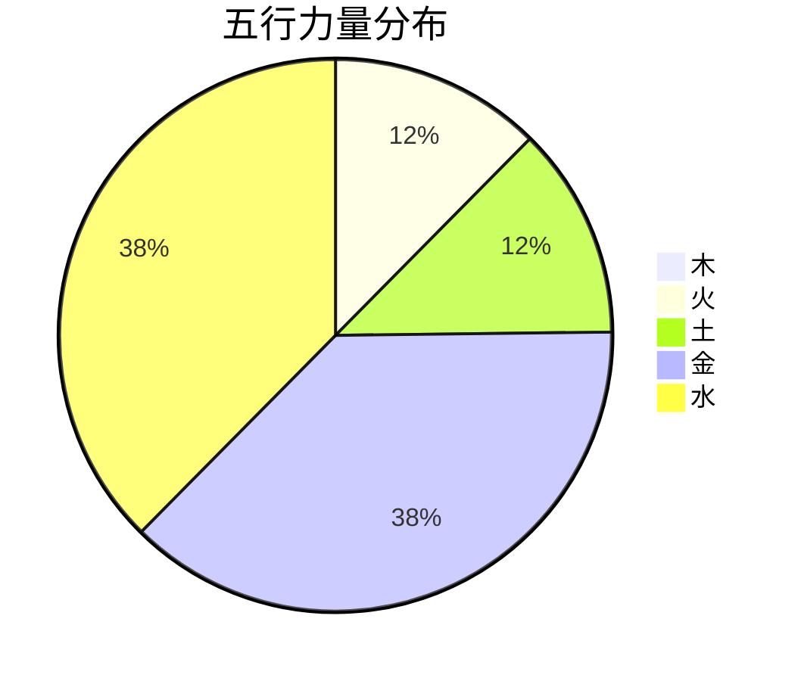
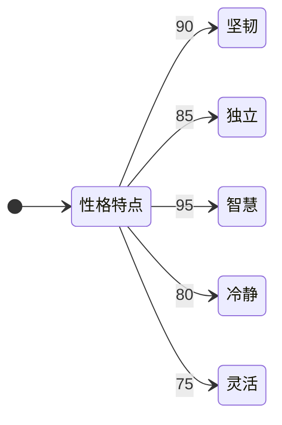
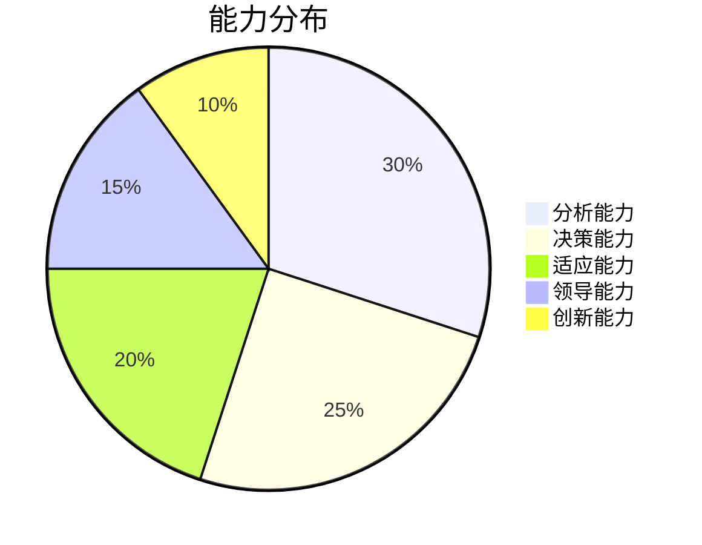
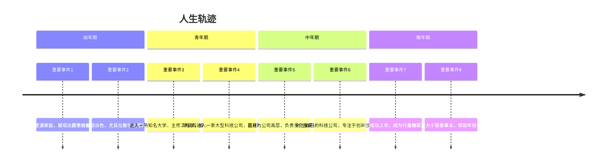

# 费元华 的角色分析

## 基本信息
- 性别：男
- 出生时间：1982-12-03T12:00:00
- 纪元：future

## 八字信息
- 八字：壬戌辛亥庚申壬午

### 八字结构

### 五行分布

## 世界背景
未知世界背景

### 角色描述：费元华

#### 基本信息
- **姓名**：费元华
- **性别**：男性
- **出生时间**：1982年12月3日12:00
- **纪元**：未知
- **八字**：壬戌 辛亥 庚申 壬午
- **五行统计**：木: 0, 火: 1, 土: 1, 金: 3, 水: 3
- **日主**：金
- **格局**：印比格

#### 性格特点
费元华是一个典型的印比格人物，性格坚韧、独立且富有智慧。他的五行中金和水占主导，赋予了他冷静、理智的特质，同时也具备一定的灵活性和适应能力。以下是他的性格特点雷达图：

#### 天赋能力
费元华的天赋能力主要体现在他的智慧和坚韧上。他擅长分析和解决问题，能够在复杂的环境中保持冷静并找到最佳解决方案。以下是他的能力分布图：

#### 人生轨迹
费元华的人生轨迹充满了挑战和机遇。他的坚韧和智慧使他在各个阶段都能取得显著的成就。以下是他的主要人生轨迹：

#### 总结
费元华是一个典型的印比格人物，他的坚韧、智慧和冷静使他在各个阶段都能取得显著的成就。他的天赋能力主要体现在分析和决策上，能够在复杂的环境中保持冷静并找到最佳解决方案。他的人生轨迹充满了挑战和机遇，最终成为行业的领军人物，并在晚年致力于慈善事业，帮助年轻一代发展。