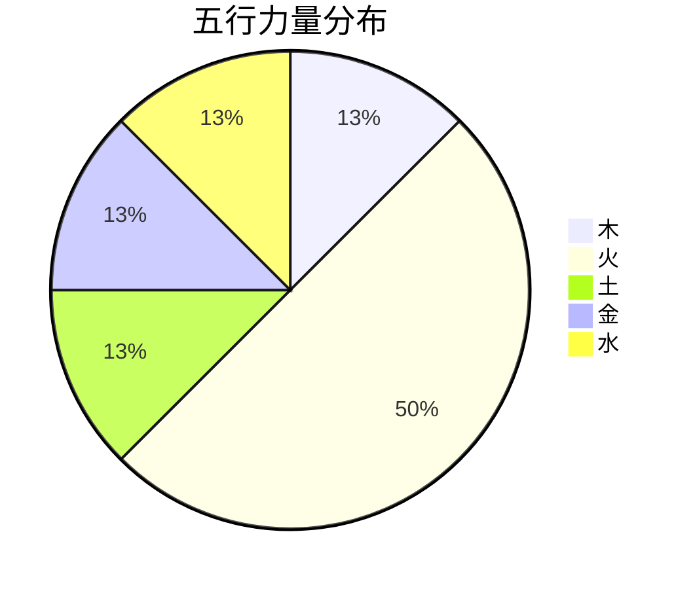
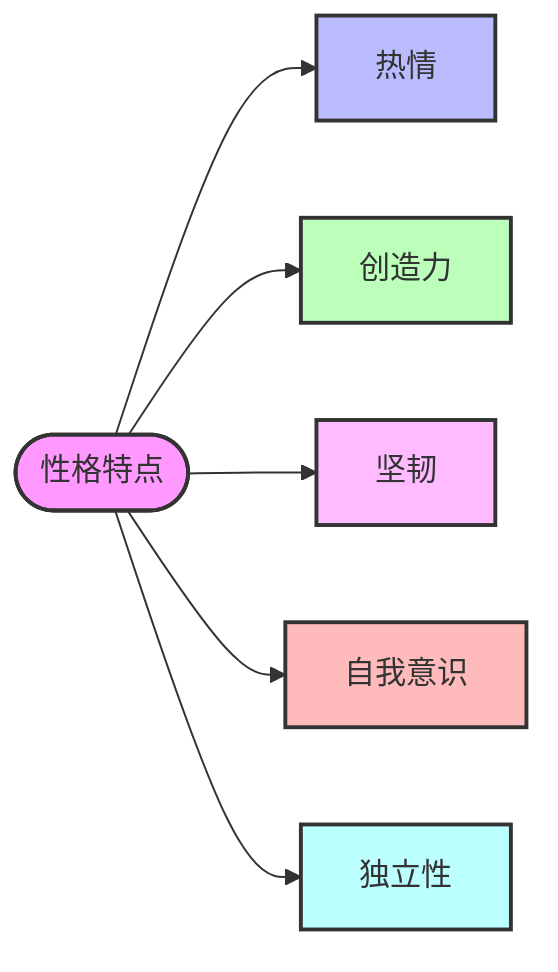
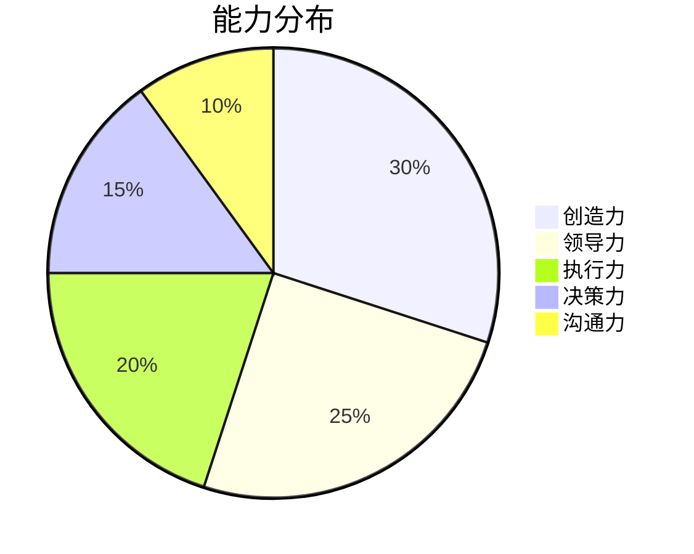
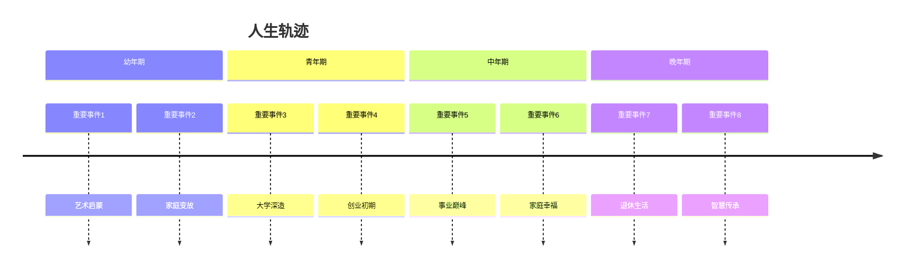

# 费琴华 的角色分析

## 基本信息
- 性别：女
- 出生时间：1987-06-30T22:00:00
- 纪元：ancient

## 八字信息
- 八字：丁卯丙午庚戌丁亥

### 八字结构
<table>
  <tr>
    <th>年柱</th>
    <th>月柱</th>
    <th>日柱</th>
    <th>时柱</th>
  </tr>
  <tr>
    <td style='background-color:#f9f9ff;text-align:center;font-weight:bold;'>丁卯</td>
    <td style='background-color:#e6e6ff;text-align:center;font-weight:bold;'>丙午</td>
    <td style='background-color:#e6ffe6;text-align:center;font-weight:bold;'>庚戌</td>
    <td style='background-color:#ffe6ff;text-align:center;font-weight:bold;'>丁亥</td>
  </tr>
</table>

### 五行分布

五行分布详情（点击展开）

<table>
  <tr>
    <th>金</th>
    <th>木</th>
    <th>水</th>
    <th>火</th>
    <th>土</th>
  </tr>
  <tr>
    <td style='background-color:#FFD700;text-align:center;'>1 (25%)</td>
    <td style='background-color:#90EE90;text-align:center;'>1 (25%)</td>
    <td style='background-color:#87CEFA;text-align:center;'>1 (25%)</td>
    <td style='background-color:#FF6347;text-align:center;'>4 (100%)</td>
    <td style='background-color:#D2B48C;text-align:center;'>1 (25%)</td>
  </tr>
</table>

## 世界背景
未知世界背景

### 角色描述：费琴华

#### 基本信息
- **姓名**：费琴华
- **性别**：女性
- **出生时间**：1987年6月30日22:00
- **纪元**：未知
- **八字**：丁卯 丙午 庚戌 丁亥
- **五行统计**：木: 1, 火: 4, 土: 1, 金: 1, 水: 1
- **日主**：金
- **格局**：偏财格

#### 性格特点
费琴华的性格特点可以从她的八字中窥见一斑。她的五行中火元素极为旺盛，这赋予了她热情、活力和创造力的特质。同时，日主为金，表明她具有坚韧不拔的意志和强烈的自我意识。

性格特点详情（点击展开）

<table>
  <tr>
    <th colspan="5">性格特点</th>
  </tr>
  <tr>
    <td style='background-color:#f9f9ff;text-align:center;'>热情</td>
    <td style='background-color:#e6e6ff;text-align:center;'>创造力</td>
    <td style='background-color:#e6ffe6;text-align:center;'>坚韧</td>
    <td style='background-color:#ffe6ff;text-align:center;'>自我意识</td>
    <td style='background-color:#fff9e6;text-align:center;'>独立性</td>
  </tr>
</table>

#### 天赋能力
费琴华的天赋能力主要体现在她的创造力和领导力上。她的火元素旺盛，使得她在艺术和创意领域有着非凡的天赋。同时，她的金元素赋予了她强大的执行力和决策能力。

能力分布详情（点击展开）

<table>
  <tr>
    <th>创造力</th>
    <th>领导力</th>
    <th>执行力</th>
    <th>决策力</th>
    <th>沟通力</th>
  </tr>
  <tr>
    <td style='background-color:#FFD700;text-align:center;'>30%</td>
    <td style='background-color:#90EE90;text-align:center;'>25%</td>
    <td style='background-color:#87CEFA;text-align:center;'>20%</td>
    <td style='background-color:#FF6347;text-align:center;'>15%</td>
    <td style='background-color:#D2B48C;text-align:center;'>10%</td>
  </tr>
</table>

#### 人生轨迹
费琴华的人生轨迹充满了挑战和机遇。她的幼年期和青年期充满了学习和探索，中年期则是她事业和人生的巅峰，晚年期则更多地关注于内心的平和和智慧的积累。

人生轨迹详情（点击展开）

<table>
  <tr>
    <th colspan="2">幼年期</th>
  </tr>
  <tr>
    <td style='background-color:#f9f9ff;'>艺术启蒙</td>
    <td>在幼年期，费琴华展现出对艺术的浓厚兴趣，开始学习绘画和音乐。</td>
  </tr>
  <tr>
    <td style='background-color:#f9f9ff;'>家庭变故</td>
    <td>家庭经历了一次重大变故，这对她的性格产生了深远影响。</td>
  </tr>
  <tr>
    <th colspan="2">青年期</th>
  </tr>
  <tr>
    <td style='background-color:#e6e6ff;'>大学深造</td>
    <td>在大学期间，费琴华选择了艺术设计专业，进一步深造。</td>
  </tr>
  <tr>
    <td style='background-color:#e6e6ff;'>创业初期</td>
    <td>毕业后，她开始了自己的创业之路，创办了一家设计公司。</td>
  </tr>
  <tr>
    <th colspan="2">中年期</th>
  </tr>
  <tr>
    <td style='background-color:#e6ffe6;'>事业巅峰</td>
    <td>她的设计公司逐渐壮大，成为行业内的佼佼者。</td>
  </tr>
  <tr>
    <td style='background-color:#e6ffe6;'>家庭幸福</td>
    <td>在事业成功的同时，她也拥有了幸福的家庭生活。</td>
  </tr>
  <tr>
    <th colspan="2">晚年期</th>
  </tr>
  <tr>
    <td style='background-color:#ffe6ff;'>退休生活</td>
    <td>退休后，费琴华开始享受平静的生活，专注于个人兴趣。</td>
  </tr>
  <tr>
    <td style='background-color:#ffe6ff;'>智慧传承</td>
    <td>她将自己的经验和智慧传授给年轻一代，成为他们的导师。</td>
  </tr>
</table>

费琴华的一生充满了激情与挑战，她的坚韧和创造力使她在各个阶段都能克服困难，取得成功。她的故事激励着周围的人，成为他们心中的榜样。